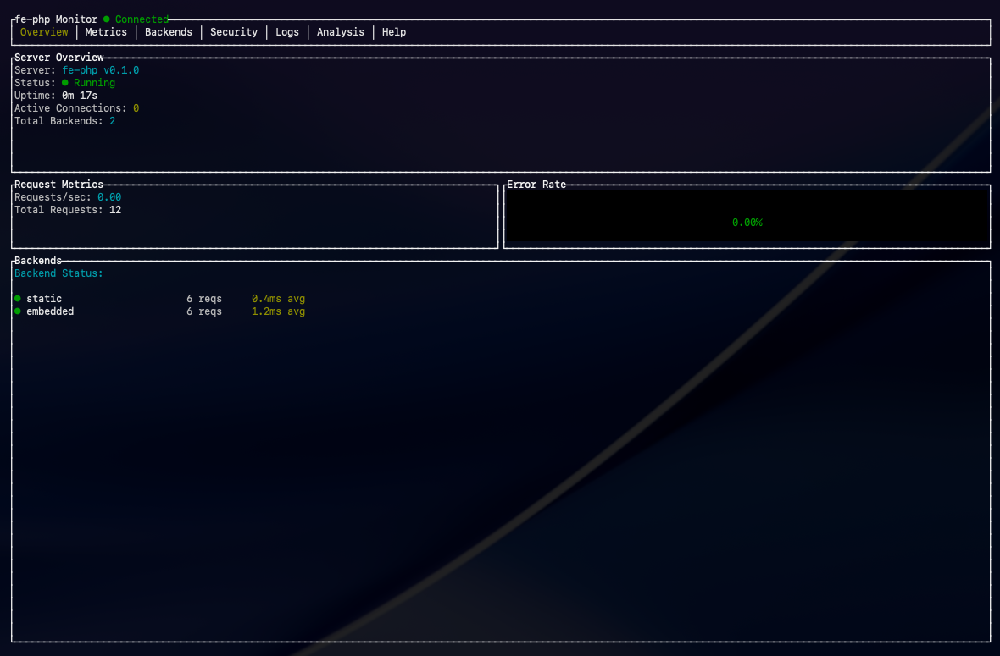
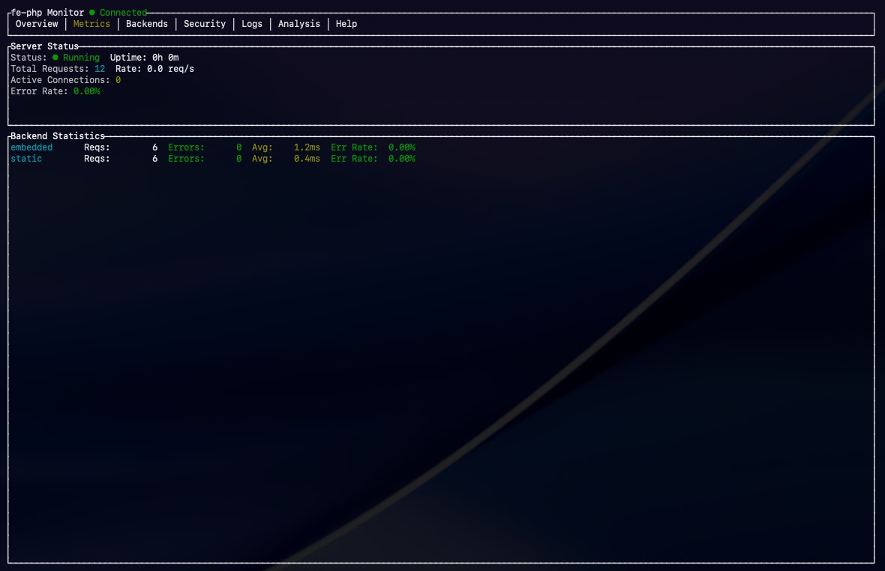
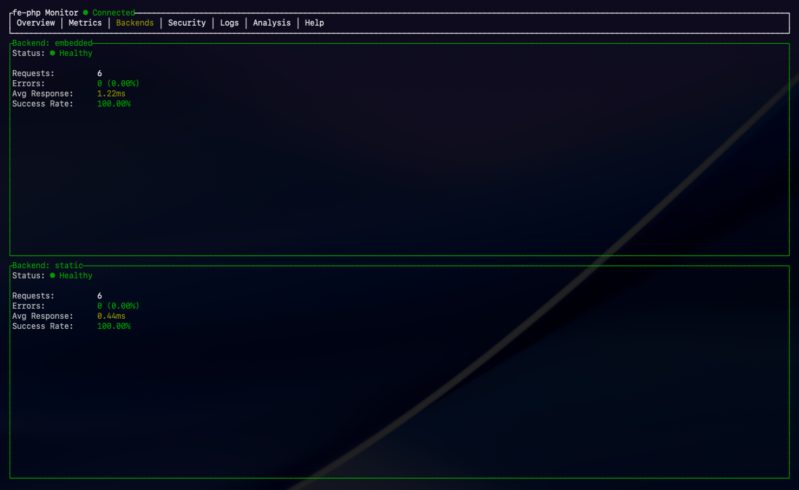
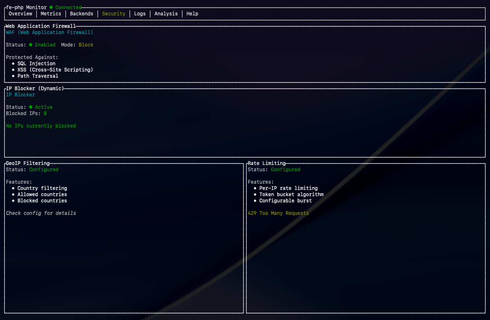
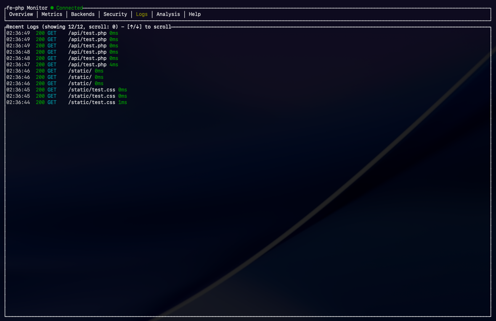
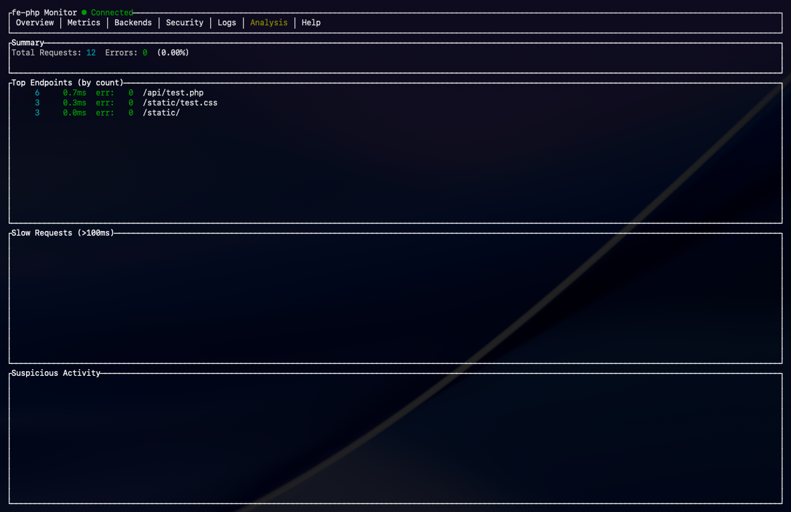
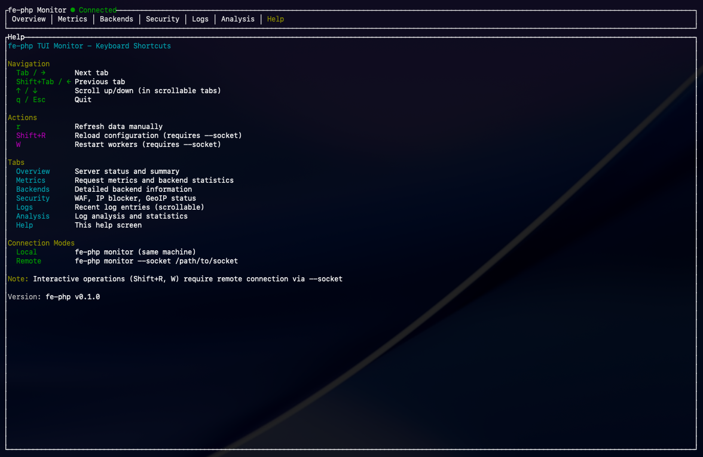

# Monitoring

fe-phpは3つの監視方法を提供しています：TUI Monitor、Admin API、Prometheusメトリクス。

## TUI Monitor

ターミナルベースのリアルタイム監視ツールです。SSH経由でのリモート監視に適しています。

### 画面イメージ









### 起動方法

#### ローカル監視（開発時）

```bash
fe-php monitor
```

サーバーと同じホストで実行し、自動的に適切な接続方法を選択します。

#### リモート監視（Unix Socket）

```bash
fe-php monitor --socket /var/run/fe-php-admin.sock
```

Unix Socket経由で稼働中のサーバーに接続します。推奨される方法です。

#### SSH経由でのリモート監視

```bash
ssh production-server "fe-php monitor --socket /var/run/fe-php-admin.sock"
```

SSH接続を介してリモートサーバーを監視できます。

#### JSON形式出力（スクリプト連携）

```bash
fe-php monitor --format json --socket /var/run/fe-php-admin.sock
```

JSON形式で1回のみ出力し、終了します。監視スクリプトとの連携に使用できます。

#### テキスト形式出力

```bash
fe-php monitor --format text --socket /var/run/fe-php-admin.sock
```

シンプルなテキスト形式で出力します。

### TUIの使い方

#### タブ一覧

Monitor TUIは7つのタブで構成されています：

1. **Overview**: サーバー概要とメトリクス
2. **Metrics**: 詳細メトリクス
3. **Backends**: バックエンド別統計
4. **Security**: ブロック済みIP一覧
5. **Logs**: リクエストログ
6. **Analysis**: ログ分析結果
7. **Help**: ヘルプ

#### キーボード操作

| キー | 動作 |
|------|------|
| `Tab` | 次のタブへ移動 |
| `Shift+Tab` | 前のタブへ移動 |
| `↑` / `k` | 上にスクロール |
| `↓` / `j` | 下にスクロール |
| `r` | 手動リフレッシュ |
| `q` / `Ctrl+C` | 終了 |

#### Overviewタブ

サーバーの基本情報とメトリクスを表示します。

表示内容:
- サーバーバージョン
- 稼働時間（Uptime）
- プロセスID（PID）
- 開始時刻
- 1秒あたりのリクエスト数（RPS）
- アクティブ接続数
- 総リクエスト数
- エラー率

#### Metricsタブ

詳細なメトリクス情報を表示します。

表示内容:
- HTTPメトリクス（リクエスト総数、エラー総数、アクティブ接続）
- バックエンドメトリクス（バックエンド別のリクエスト数、エラー数、平均応答時間）
- システムメトリクス（CPU使用率、メモリ使用量）

#### Backendsタブ

バックエンド別の統計情報を表示します。

表示内容:
- バックエンド名
- タイプ（Embedded、FastCGI、Static）
- ステータス（Healthy、Unhealthy）
- リクエスト数
- エラー数
- 平均応答時間（ミリ秒）

#### Securityタブ

セキュリティ関連の情報を表示します。

表示内容:
- ブロック済みIPアドレス一覧
- 各IPのブロック理由
- ブロック時刻

#### Logsタブ

最近のリクエストログを表示します（最大100件）。

表示内容:
- タイムスタンプ
- HTTPステータスコード（色分け表示）
- HTTPメソッド
- URI
- 処理時間（ミリ秒、100ms超は赤で表示）

ステータスコード別の色分け:
- 2xx（成功）: 緑
- 3xx（リダイレクト）: シアン
- 4xx（クライアントエラー）: 黄
- 5xx（サーバーエラー）: 赤

#### Analysisタブ

ログの自動分析結果を表示します。

表示内容:
- エンドポイント別統計（上位10件）
  - パス
  - リクエスト数
  - 平均処理時間
  - エラー数
  - エラー率
- スローリクエスト（100ms超、上位10件）
  - URI
  - 処理時間
  - ステータスコード
- 不審なアクティビティ
  - IPアドレス
  - イベントタイプ（scan、errors）
  - 回数
  - 説明

不審なアクティビティの検出ルール:
- **Scan**: 同一IPから10回以上の404エラー
- **Errors**: 同一IPから5回以上の5xxエラー

### 設定

TUI Monitorを有効にするには、Admin APIを有効化する必要があります。

```toml
[admin]
enable = true
unix_socket = "/var/run/fe-php-admin.sock"
http_port = 9001
```

### トラブルシューティング

#### 接続エラー

```
Connection Error: No such file or directory (os error 2)
```

解決方法:
1. サーバーが起動していることを確認
2. Unix Socketパスが正しいことを確認
3. Admin APIが有効化されていることを確認

#### 権限エラー

```
Connection Error: Permission denied (os error 13)
```

解決方法:
1. Unix Socketのパーミッションを確認：`ls -la /var/run/fe-php-admin.sock`
2. 必要に応じて権限を変更：`sudo chmod 666 /var/run/fe-php-admin.sock`
3. またはsudoで実行：`sudo fe-php monitor --socket /var/run/fe-php-admin.sock`

## Admin API

Unix SocketまたはHTTP経由でサーバーを管理するためのAPIです。

### エンドポイント

#### HTTP API

設定:
```toml
[admin]
enable = true
host = "127.0.0.1"
http_port = 9001
allowed_ips = ["127.0.0.1", "::1"]
```

エンドポイント:
- `GET /api/status` - サーバー状態取得
- `GET /api/health` - ヘルスチェック
- `GET /api/logs/recent` - 最近のログ取得
- `GET /api/logs/analysis` - ログ分析結果取得
- `GET /api/security/blocked-ips` - ブロック済みIP一覧取得
- `POST /api/config/reload` - 設定リロード
- `POST /api/workers/restart` - ワーカー再起動
- `POST /api/security/block-ip` - IP ブロック
- `POST /api/security/unblock-ip` - IPブロック解除

#### Unix Socket API

設定:
```toml
[admin]
enable = true
unix_socket = "/var/run/fe-php-admin.sock"
```

JSONプロトコル:
```bash
echo '{"command":"status"}' | socat - UNIX-CONNECT:/var/run/fe-php-admin.sock
echo '{"command":"reload_config"}' | socat - UNIX-CONNECT:/var/run/fe-php-admin.sock
echo '{"command":"restart_workers"}' | socat - UNIX-CONNECT:/var/run/fe-php-admin.sock
echo '{"command":"block_ip","ip":"192.168.1.100"}' | socat - UNIX-CONNECT:/var/run/fe-php-admin.sock
echo '{"command":"unblock_ip","ip":"192.168.1.100"}' | socat - UNIX-CONNECT:/var/run/fe-php-admin.sock
```

テキストプロトコル:
```bash
echo "status" | socat - UNIX-CONNECT:/var/run/fe-php-admin.sock
echo "health" | socat - UNIX-CONNECT:/var/run/fe-php-admin.sock
```

### APIレスポンス例

#### GET /api/status

```json
{
  "server": {
    "version": "0.1.0",
    "uptime_seconds": 3600,
    "pid": 12345,
    "started_at": 1700000000
  },
  "metrics": {
    "requests_per_second": 150.5,
    "active_connections": 25,
    "total_requests": 541800,
    "error_rate": 2.5
  },
  "backends": [
    {
      "name": "Embedded (libphp)",
      "backend_type": "embedded",
      "status": "healthy",
      "requests": 350000,
      "errors": 8750,
      "avg_response_ms": 2.5
    },
    {
      "name": "FastCGI (PHP-FPM)",
      "backend_type": "fastcgi",
      "status": "healthy",
      "requests": 100000,
      "errors": 2500,
      "avg_response_ms": 5.0
    },
    {
      "name": "Static Files",
      "backend_type": "static",
      "status": "healthy",
      "requests": 91800,
      "errors": 0,
      "avg_response_ms": 0.1
    }
  ]
}
```

#### GET /api/health

```json
{
  "status": "healthy",
  "uptime_seconds": 3600,
  "version": "0.1.0"
}
```

#### GET /api/logs/recent?limit=10

```json
{
  "logs": [
    {
      "timestamp": "2025-11-18T12:34:56.789Z",
      "level": "info",
      "request_id": "550e8400-e29b-41d4-a716-446655440000",
      "method": "GET",
      "uri": "/api/users",
      "status": 200,
      "duration_ms": 2,
      "memory_peak_mb": 10.5,
      "opcache_hit": true,
      "worker_id": 3,
      "remote_addr": "192.168.1.100:54321",
      "user_agent": "Mozilla/5.0...",
      "waf_triggered": false
    }
  ]
}
```

#### GET /api/logs/analysis

```json
{
  "total_requests": 1000,
  "error_count": 25,
  "top_endpoints": [
    {
      "path": "/api/users",
      "count": 450,
      "avg_duration_ms": 2.5,
      "error_count": 10,
      "error_rate": 0.022
    },
    {
      "path": "/api/products",
      "count": 300,
      "avg_duration_ms": 5.0,
      "error_count": 5,
      "error_rate": 0.017
    }
  ],
  "slow_requests": [
    {
      "timestamp": "2025-11-18T12:34:56.789Z",
      "uri": "/api/reports",
      "status": 200,
      "duration_ms": 250
    }
  ],
  "suspicious_activity": [
    {
      "ip_address": "192.168.1.200",
      "event_type": "scan",
      "count": 15,
      "description": "15 404 errors (possible scanning)"
    }
  ]
}
```

#### GET /api/security/blocked-ips

```json
{
  "blocked_ips": [
    "192.168.1.200",
    "10.0.0.50"
  ]
}
```

#### POST /api/config/reload

```json
{
  "status": "success",
  "message": "Configuration reloaded successfully"
}
```

#### POST /api/workers/restart

```json
{
  "status": "success",
  "message": "Workers restarted successfully"
}
```

#### POST /api/security/block-ip

リクエスト:
```json
{
  "ip": "192.168.1.100"
}
```

レスポンス:
```json
{
  "status": "success",
  "message": "IP 192.168.1.100 blocked successfully"
}
```

#### POST /api/security/unblock-ip

リクエスト:
```json
{
  "ip": "192.168.1.100"
}
```

レスポンス:
```json
{
  "status": "success",
  "message": "IP 192.168.1.100 unblocked successfully"
}
```

### セキュリティ

#### Unix Socket

Unix Socketはファイルパーミッションで保護されます。

```bash
# ソケットのパーミッションを確認
ls -la /var/run/fe-php-admin.sock
# srwx------ 1 www-data www-data 0 Nov 18 12:00 /var/run/fe-php-admin.sock

# 必要に応じて変更
sudo chmod 600 /var/run/fe-php-admin.sock
sudo chown www-data:www-data /var/run/fe-php-admin.sock
```

推奨設定:
- パーミッション: `600`（所有者のみ読み書き可）
- 所有者: サーバープロセスと同じユーザー

#### HTTP API

HTTP APIはIPアドレスフィルタリングで保護されます。

```toml
[admin]
host = "127.0.0.1"  # ループバックアドレスのみバインド
http_port = 9001
allowed_ips = ["127.0.0.1", "::1", "10.0.0.0/8"]  # 許可するIP（CIDR表記可）
```

推奨設定:
- `host`: `127.0.0.1`（ローカルのみ）
- `allowed_ips`: 必要最小限のIPのみ許可
- ファイアウォールで外部からのアクセスを遮断

## Prometheus メトリクス

Prometheus形式のメトリクスを提供します。

### 設定

```toml
[metrics]
enable = true
endpoint = "/_metrics"
port = 9090
```

### メトリクス一覧

#### HTTPメトリクス

**active_connections** (gauge)
```
# HELP active_connections Active connections
# TYPE active_connections gauge
active_connections 25
```

**http_requests_total** (counter)
```
# HELP http_requests_total Total HTTP requests
# TYPE http_requests_total counter
http_requests_total{method="GET",status="200"} 450000
http_requests_total{method="GET",status="404"} 1250
http_requests_total{method="POST",status="200"} 91800
```

#### バックエンドメトリクス

**backend_requests_total** (counter)
```
# HELP backend_requests_total Total backend requests
# TYPE backend_requests_total counter
backend_requests_total{backend="embedded"} 350000
backend_requests_total{backend="fastcgi"} 100000
backend_requests_total{backend="static"} 91800
```

**backend_errors_total** (counter)
```
# HELP backend_errors_total Total backend errors
# TYPE backend_errors_total counter
backend_errors_total{backend="embedded",error_type="php_error"} 8750
backend_errors_total{backend="fastcgi",error_type="connection_error"} 125
backend_errors_total{backend="fastcgi",error_type="timeout"} 2375
```

**backend_request_duration_seconds** (histogram)
```
# HELP backend_request_duration_seconds Backend request duration
# TYPE backend_request_duration_seconds histogram
backend_request_duration_seconds_bucket{backend="embedded",le="0.005"} 280000
backend_request_duration_seconds_bucket{backend="embedded",le="0.01"} 340000
backend_request_duration_seconds_bucket{backend="embedded",le="0.025"} 348000
backend_request_duration_seconds_bucket{backend="embedded",le="0.05"} 349500
backend_request_duration_seconds_bucket{backend="embedded",le="0.1"} 350000
backend_request_duration_seconds_bucket{backend="embedded",le="+Inf"} 350000
backend_request_duration_seconds_sum{backend="embedded"} 875.0
backend_request_duration_seconds_count{backend="embedded"} 350000
```

#### プロセスメトリクス

**process_cpu_seconds_total** (counter)
```
# HELP process_cpu_seconds_total Total CPU time
# TYPE process_cpu_seconds_total counter
process_cpu_seconds_total 1234.56
```

**process_resident_memory_bytes** (gauge)
```
# HELP process_resident_memory_bytes Resident memory size
# TYPE process_resident_memory_bytes gauge
process_resident_memory_bytes 524288000
```

### Prometheusとの連携

#### Prometheus設定

`prometheus.yml`:

```yaml
global:
  scrape_interval: 15s

scrape_configs:
  - job_name: 'fe-php'
    static_configs:
      - targets: ['localhost:9090']
    metrics_path: '/_metrics'
```

#### Grafanaダッシュボード

主要なメトリクスの可視化例：

1. **リクエストレート**
```promql
rate(backend_requests_total[5m])
```

2. **エラー率**
```promql
rate(backend_errors_total[5m]) / rate(backend_requests_total[5m])
```

3. **P50レイテンシ**
```promql
histogram_quantile(0.5, rate(backend_request_duration_seconds_bucket[5m]))
```

4. **P99レイテンシ**
```promql
histogram_quantile(0.99, rate(backend_request_duration_seconds_bucket[5m]))
```

5. **アクティブ接続数**
```promql
active_connections
```

### アラート設定

`alert.rules`:

```yaml
groups:
  - name: fe-php
    interval: 30s
    rules:
      - alert: HighErrorRate
        expr: rate(backend_errors_total[5m]) / rate(backend_requests_total[5m]) > 0.05
        for: 5m
        labels:
          severity: critical
        annotations:
          summary: "High error rate detected"
          description: "Error rate is {{ $value | humanizePercentage }}"

      - alert: HighLatency
        expr: histogram_quantile(0.99, rate(backend_request_duration_seconds_bucket[5m])) > 0.5
        for: 5m
        labels:
          severity: warning
        annotations:
          summary: "High latency detected"
          description: "P99 latency is {{ $value }}s"

      - alert: TooManyConnections
        expr: active_connections > 1000
        for: 1m
        labels:
          severity: warning
        annotations:
          summary: "Too many active connections"
          description: "Active connections: {{ $value }}"
```

## 監視のベストプラクティス

### 開発環境

- TUI Monitorを使用してリアルタイムで状態を確認
- ログレベルを`debug`に設定
- `validate_timestamps = true`でOPcacheのタイムスタンプ検証を有効化

```toml
[logging]
level = "debug"
format = "text"

[php.opcache]
validate_timestamps = true
```

### 本番環境

- Prometheus + Grafanaで継続的な監視
- Admin APIは Unix Socketのみ有効化（HTTP APIは無効化）
- ログレベルは`info`または`warn`
- アラートルールを設定

```toml
[admin]
enable = true
unix_socket = "/var/run/fe-php-admin.sock"
# http_port は設定しない（HTTP API無効化）

[metrics]
enable = true
port = 9090

[logging]
level = "info"
format = "json"
output = "/var/log/fe-php/access.log"
```

### SSH経由でのリモート監視

```bash
# 監視スクリプト例
#!/bin/bash
ssh production-server "fe-php monitor --socket /var/run/fe-php-admin.sock --format json" | \
jq '.server_status.metrics'
```

### 定期的なヘルスチェック

```bash
# cron設定例（1分ごとにヘルスチェック）
* * * * * curl -f http://localhost:8080/_health || systemctl restart fe-php
```
